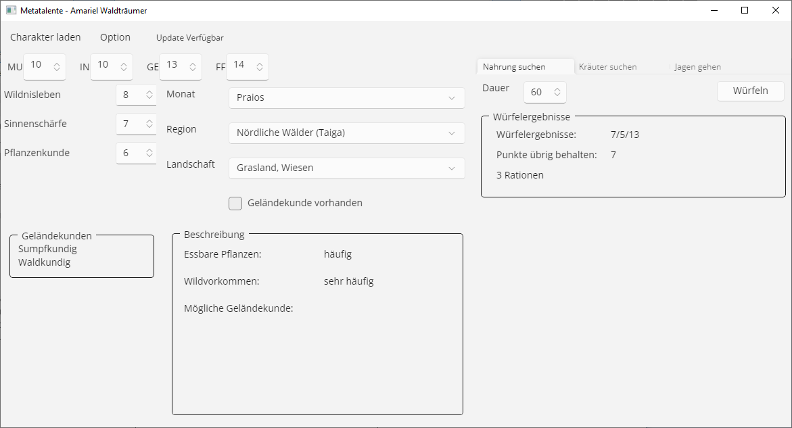

# Metatalente (DSA 4.1)

Metatalente ist ein Verwaltungsprogramm für das deutsche Pen&Paper Rollenspiel "Das Schwarze Auge" Version 4.1.
Es ist Generator für Metatalente der alle Berechnungen übernimmt und somit langwieriges blättern in Regelbüchern und ewiges würfeln überflüssig macht.